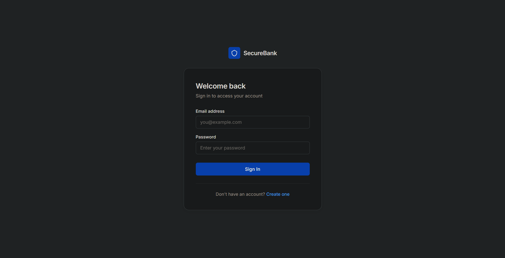
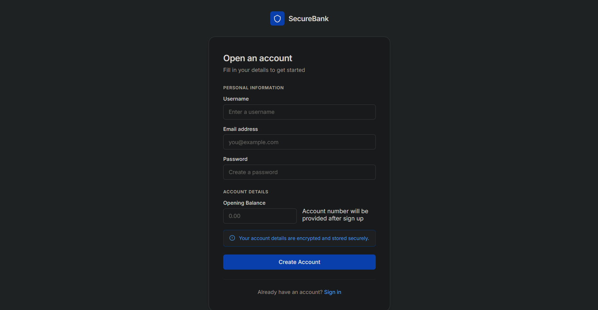
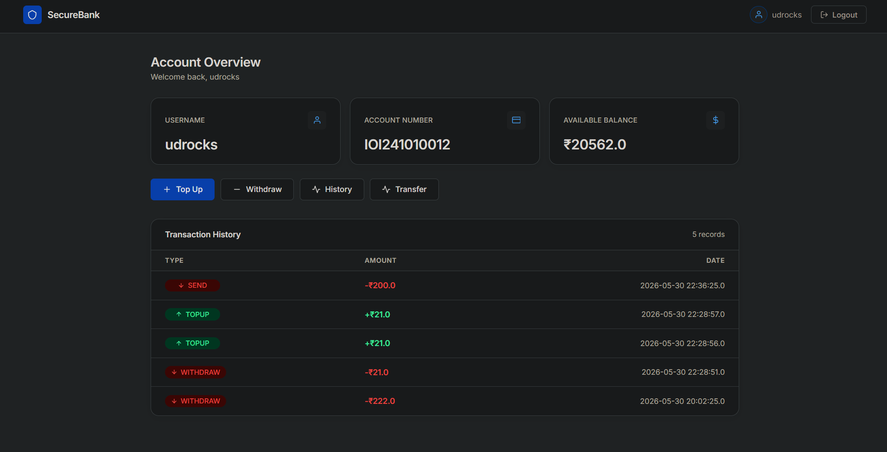

# SecureBank - Java Banking Application

## Overview

SecureBank is a banking web application built using Java Servlets, JSP, JDBC, and MySQL following the MVC architecture. The application allows users to create accounts, securely log in, manage funds, transfer money between accounts, and view transaction history.

The primary goal of this project was to gain hands-on experience with backend development concepts such as authentication, session management, database transactions, security, and real-world banking workflows.

---

## Features

### User Management

* User Registration
* Secure Login
* Logout Functionality
* Session-Based Authentication
* Password Hashing using BCrypt

### Banking Operations

* Account Number Generation
* Add Funds (Topup)
* Withdraw Funds
* Transfer Money Between Accounts
* Balance Management

### Transaction Management

* Transaction History
* Recent Transactions Dashboard
* Full Transaction Records
* Transaction Type Tracking

  * Topup
  * Withdraw
  * Send
  * Received

### Security Features

* BCrypt Password Encryption
* Authentication Filter
* Session Validation
* Protected Routes
* Input Validation

### Email Notifications

* Welcome Email on Signup
* Login Alert Email
* Topup Notification Email
* Withdrawal Notification Email
* Transfer Notification Email

### Database Reliability

* JDBC Transaction Management
* Commit and Rollback Support
* Atomic Fund Transfers
* ACID-Compliant Money Transfers

---

## Technology Stack

### Backend

* Java
* Java Servlets
* JSP
* JDBC

### Database

* MySQL

### Frontend

* HTML
* CSS
* JavaScript

### Security

* BCrypt

### Email Service

* JavaMail API
* Gmail SMTP

### Server

* Apache Tomcat

---

## Project Architecture

MVC (Model View Controller) Architecture

```text
Controller
│
├── LoginServlet
├── SignupServlet
├── DashboardServlet
├── TopupServlet
├── WithdrawServlet
├── TransferServlet
├── FullHistoryServlet
└── LogoutServlet

DAO Layer
│
├── UserDAO
└── TransactionDAO

Model Layer
│
├── User
└── Transaction

View Layer
│
├── login.jsp
├── signup.jsp
├── dashboard.jsp
├── topup.jsp
├── withdraw.jsp
├── transferpage.jsp
└── viewhistory.jsp
```

---

## Database Tables

### Users Table

| Column         | Description              |
| -------------- | ------------------------ |
| id             | User ID                  |
| username       | User Name                |
| email          | User Email               |
| password       | BCrypt Hashed Password   |
| account_number | Generated Account Number |
| balance        | Current Balance          |

### Transactions Table

| Column           | Description        |
| ---------------- | ------------------ |
| id               | Transaction ID     |
| user_id          | User Reference     |
| transaction_type | Transaction Type   |
| amount           | Transaction Amount |
| created_at       | Timestamp          |

---

## Banking Workflow

### Money Transfer

```text
Sender
   ↓
Balance Validation
   ↓
Deduct Amount
   ↓
Add Amount To Receiver
   ↓
Insert Transaction Records
   ↓
Commit Transaction
   ↓
Send Email Notification
```

If any operation fails:

```text
Rollback Transaction
```

ensuring money consistency.

---

## Security Implementations

### Password Encryption

Passwords are never stored in plain text.

```java
BCrypt.hashpw(password, BCrypt.gensalt())
```

### Password Verification

```java
BCrypt.checkpw(rawPassword, hashedPassword)
```

### Authentication Filter

Protected routes:

```text
/dashboard
/topup
/withdraw
/transfer
/history
```

Unauthenticated users are redirected to the login page.

---

## Email Notifications

Users receive automated email notifications for:

* Successful Account Creation
* Successful Login
* Money Added
* Money Withdrawn
* Money Transferred
* Money Received

Email operations run in background threads to improve user experience and reduce response time.

---

## Screenshots

Add screenshots here.

### Login Page



### Signup Page



### Dashboard



### Transfer Page


### Transaction History


---

## Future Improvements

* OTP Verification
* Forgot Password Functionality
* Admin Dashboard
* Account Statement PDF Export
* REST APIs
* Spring Boot Migration
* Docker Deployment
* Cloud Deployment

---

## Learning Outcomes

This project helped me gain practical experience with:

* MVC Architecture
* JDBC
* MySQL
* Authentication & Authorization
* Session Management
* BCrypt Security
* JavaMail Integration
* Database Transactions
* Commit & Rollback
* Servlet Filters
* Multithreading
* Banking Workflow Design

---

## Author

**Udhay Nayyar**

Java Backend Developer

Built as a learning project to understand real-world backend development and banking system workflows.
